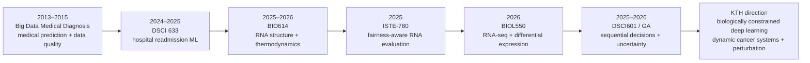

# KTH LIVE INTERVIEW GUIDE — Deep Learning for Biological Systems

**Interview:** 2026-08-24, 13:00 Stockholm / 07:00 New York  
**Interviewers:** Matthieu Raphael Barreau + Avlant Nilsson  
**Position:** PA-2026-1420 — Doctoral student in deep learning for biological systems

> **USE THIS PAGE DURING THE INTERVIEW.** It is not a study packet. Every section is designed to answer: **What did I actually do? How do I explain it in 30–60 seconds? Where is the proof if I need to open it?**

**Rule:** answer first, evidence second. Do not read links aloud. If they probe, open the relevant artifact.

**Submitted KTH CV:** [GitHub packet PDF](../../APPLICATIONS/PhD/review-by-application/05-kth-deep-learning-biological-systems/2026-07-31-kth-deep-learning-biological-systems-cv.pdf) · [Drive copy](https://drive.google.com/file/d/1H145KE2bxEG0R7klIoGkqfn86kcd4olg/view?usp=drivesdk)

---

## 1. Research-profile claim defense

### CV claim: “Graduate researcher focused on deep learning and computational biology”

**What I actually did:** My computational-biology work includes RNA secondary-structure modeling, RNA-seq differential-expression analysis, and fairness-aware evaluation of RNA prediction methods. My deep-learning foundation comes from graduate Neural Networks coursework with hands-on RNN/LSTM implementation, plus neural/contextual bandit research and neural-style baselines in ISTE-780.

**Safe spoken version:**

> My work sits at the intersection of machine learning and computational biology. The strongest biological artifacts are my RNA structure and RNA-seq projects, while my strongest hands-on neural-network foundation comes from graduate Neural Networks coursework and my current sequential-learning research. What I want from this PhD is to bring those strands together much more deeply in a mechanistic biological setting.

**Proof:** [BIO614 KTH writing sample](https://drive.google.com/file/d/1x_xLkbu-JGHrqH8gf7DaFwNMtGs-qquZ/view?usp=drivesdk) · [BIOL550 repo](https://github.com/pzg8794/BIOL550-Project_Paper) · [ISTE-780 KTH writing sample](https://drive.google.com/file/d/1VvE4oNsAx6lFlppTv0VjI_GTGDsbkN-v/view?usp=drivesdk) · [DSCI 640 Lecture 5 — RNNs](https://drive.google.com/file/d/1E3V3M-cL8DdqpYRgkMLVzS5yDvbtjzJE/view?usp=drivesdk) · [DSCI 640 PA2 Part 4 — LSTM](https://drive.google.com/file/d/1K8zJDmrcyVUy3Yi6EPbn1XpIC8VxIWnP/view?usp=drivesdk)

---

### CV claim: “hands-on experience in neural network-based approaches to biological sequence and structure data”

**What I actually did:** ISTE-780 compared RNA-structure methods that included ML-feature, Transformer-style and graph-neural baselines. Separately, DSCI 640 required low-level recurrent-network implementation, including Jordan/Elman recurrence, forward/backward propagation, time-series prediction and an LSTM node.

**Important boundary:** Do **not** make BIO614 itself sound like an LSTM paper. The submitted BIO614 manuscript is primarily **Nussinov dynamic programming + thermodynamic/MFE modeling**. The cleanest hands-on LSTM evidence is DSCI 640.

**Safe spoken version if they challenge the CV wording:**

> I would phrase that more precisely today. My BIO614 manuscript itself is a dynamic-programming and thermodynamic RNA-modeling project. My hands-on RNN/LSTM implementation comes from my graduate Neural Networks course, and my ISTE-780 work evaluated neural-style RNA baselines. The PhD is attractive precisely because it would let me integrate those areas at a much more serious research level.

**Proof:** [ISTE-780 submitted manuscript](https://drive.google.com/file/d/1VvE4oNsAx6lFlppTv0VjI_GTGDsbkN-v/view?usp=drivesdk) · [Lecture 5](https://drive.google.com/file/d/1E3V3M-cL8DdqpYRgkMLVzS5yDvbtjzJE/view?usp=drivesdk) · [Lecture 6 — RNN backward pass](https://drive.google.com/file/d/1KEBQz-2Z9O373hVoE44ibeh8CwbiT7xd/view?usp=drivesdk) · [Lecture 7 — memory cells](https://drive.google.com/file/d/1ELmiTOTOreE9lQgGg-4Qs3-1PsLjAXRY/view?usp=drivesdk) · [PA2 Part 4 — LSTM implementation](https://drive.google.com/file/d/1K8zJDmrcyVUy3Yi6EPbn1XpIC8VxIWnP/view?usp=drivesdk)

---

### CV claim: “RNA secondary structure prediction with thermodynamic deep learning enhancements (BIO614)”

**What I actually did:** I implemented and extended Nussinov dynamic programming, integrated thermodynamic MFE information using Turner parameters and ViennaRNA/RNAfold, added environmental/energy corrections, generated structure visualizations, and validated predictions using sensitivity, specificity, MCC and energetic comparisons. Synthetic motifs such as the hairpin and mini-helix performed extremely well; realistic tRNA and 5S rRNA exposed the model’s inability to capture multiloops/junctions and realistic topology.

**Best interview message:** the failure is stronger evidence of research maturity than the “>90% synthetic accuracy” line.

> On controlled synthetic motifs the approach worked very well, but realistic RNAs exposed a structural mismatch. High specificity did not mean the fold was biologically correct. That taught me to distinguish metric performance from mechanistic validity.

**If they ask specifically about “deep learning enhancements”:**

> The thermodynamic enhancement in the BIO614 manuscript was to the Nussinov algorithm using MFE/Turner/ViennaRNA. I would not call that component itself deep learning. My deep-learning experience comes from the neural-network coursework and related ML projects. The CV compressed those strands too aggressively.

**Proof:** [Exact KTH BIO614 writing sample](https://drive.google.com/file/d/1x_xLkbu-JGHrqH8gf7DaFwNMtGs-qquZ/view?usp=drivesdk) · [Canonical BIO614 Overleaf](https://www.overleaf.com/project/68a761a470c296440522a537) · [BIO614/BIO630 index entry](../../MASTER_RESEARCH_INDEX.md#bio630--bio614--final-project-proposal)

---

### CV claim: “RNA-seq differential-expression analysis (BIO550)”

**What I actually did:** I worked through a bulk RNA-seq reanalysis of murine DRG neurons following sciatic-nerve injury, including preprocessing/QC, alignment evidence, DESeq2 differential expression, PCA/distance/dispersion interpretation, and biological/pathway-level interpretation. The paper and supporting methods are version-controlled.

**Safe spoken version:**

> My RNA-seq work gave me experience with the less glamorous but essential side of biological modeling: QC, preprocessing, alignment support, differential expression and asking whether the biological interpretation is actually supported by the data.

**Proof:** [BIOL550 project repo](https://github.com/pzg8794/BIOL550-Project_Paper) · [Main paper source](https://github.com/pzg8794/BIOL550-Project_Paper/blob/main/main.tex) · [Pipeline architecture diagram](https://github.com/pzg8794/BIOL550-Project_Paper/blob/main/assets_methods/biol550_pipeline_architecture_diagram.svg) · [Canonical Overleaf](https://www.overleaf.com/project/69e646218e011fb4b09687b5)

---

### CV claim: “fairness-aware ML applied to bioinformatics diagnostics (ISTE-780)”

**What I actually did:** I built an exploratory fairness-evaluation framework around RNA secondary-structure prediction. The final dataset contained 20 RNA sequences; the framework compared six algorithmic approaches, used Optuna tuning, five-fold cross-validation, statistical testing, disparate-impact-style monitoring and post-processing calibration.

**Critical precision:** the measured groups were **sequence type, GC-content bins and sequence-length bins**. They were **not human demographic groups**.

**Safe spoken version:**

> The question was whether aggregate performance could hide systematic differences across biologically meaningful input classes. I adapted group-disparity tools to sequence type, GC content and length. I treat it as methodological fairness work at the sequence level, not as proof of demographic or clinical fairness.

**Proof:** [Exact KTH ISTE-780 writing sample](https://drive.google.com/file/d/1VvE4oNsAx6lFlppTv0VjI_GTGDsbkN-v/view?usp=drivesdk) · [Canonical Phase 4 Overleaf](https://www.overleaf.com/project/687b2ee4bacc2838e411460b) · [ISTE780 mirror](https://github.com/pzg8794/ISTE780-clinical-drive-mirror)

---

### CV claim: “reproducible evaluation pipeline design for biological data”

**What I actually did:** Across BIO614, ISTE-780 and BIOL550, the recurring pattern was not merely fitting a model: I built validation/reporting workflows, compared baselines, tracked metrics, used cross-validation/QC, and preserved code/paper artifacts so results could be reproduced and challenged.

**Safe spoken version:**

> Reproducibility is one of the strongest common threads in my work. I try to make the pipeline expose where the result came from — preprocessing, assumptions, baselines, metrics and failure cases — rather than treating the final score as the experiment.

**Proof:** [BIO614 manuscript](https://drive.google.com/file/d/1x_xLkbu-JGHrqH8gf7DaFwNMtGs-qquZ/view?usp=drivesdk) · [ISTE-780 manuscript](https://drive.google.com/file/d/1VvE4oNsAx6lFlppTv0VjI_GTGDsbkN-v/view?usp=drivesdk) · [BIOL550 repo](https://github.com/pzg8794/BIOL550-Project_Paper)

---

### CV claim: “Current Graduate Assistant work deepens expertise in neural architectures, uncertainty quantification, and structured experimental methodology”

**What I actually did:** My GA/research work evaluates multi-armed, contextual, adversarial and neural bandit methods for quantum-network routing/resource allocation under stochastic and adversarial conditions. We compare policies such as UCB/Thompson variants, NeuralUCB-style methods and predictive-context methods; the research emphasizes uncertainty-aware exploration, changing environments, reproducible multi-testbed evaluation and failure analysis.

**Precision:** NeuralUCB/EXPNeuralUCB use neural reward estimation but are not automatically RNNs. The original iCMAB direction uses EXAMM-evolved recurrent world/controller models; the current iCPursuitNeuralUCB implementation uses ARIMA forecasting for predictive context.

**Safe spoken version:**

> The domain is quantum networking, but the transferable research problem is sequential learning under uncertainty: what state information is available, what is missing, how much confidence we have in an action, how the environment changes, and whether a policy remains reliable when conditions shift.

**Proof:** [QuantumFaultTolerant research workspace](https://github.com/pzg8794/QuantumFaultTolerant) · [Current ICNP-style manuscript source](https://github.com/pzg8794/QuantumFaultTolerant/blob/main/ICNP_2026_venue_draft.tex) · [DSCI601 repo](https://github.com/pzg8794/DSCI601-Project_Proposal) · [GA research notes](https://drive.google.com/file/d/1Og91TkKAUk2euKtJtea5eAe1BjzzykdY/view?usp=drivesdk) · [iCMAB + EXPNeuralUCB integration notes](https://docs.google.com/document/d/19D_XEKoh6HEgOiXioooDyPGoSI1lWsUcKOOCUoHEZkQ/edit?usp=drivesdk)

---

### CV research interests

**Deep learning for biological sequence/structure; genomics/transcriptomics; RNA structure/differential expression; fairness-aware reproducible biomedical ML; uncertainty in biological ML.**

**How to defend this as an actual trajectory, not a keyword list:**

> These interests did not appear only for this application. I have repeatedly moved my projects toward health and biological data: early medical-diagnosis work, hospital-readmission modeling, RNA structure, fairness-aware bioinformatics, RNA-seq, and now adaptive decision-making under uncertainty. The gap I want to close next is exactly what this PhD offers: biologically constrained deep learning for a dynamic molecular system, connected to perturbation and experimental validation.

---

## 2. Research and Professional Experience — live defense map

### RIT Graduate Assistant — Quantum and AI Research

**What I did:** I build and evaluate adaptive decision systems for quantum-network routing/resource allocation, with contextual, adversarial and neural bandit families. The work is organized around reproducible evaluation, multiple testbeds/threat conditions, logging, comparative baselines, uncertainty-aware exploration and manuscript-level analysis.

**Why KTH should care:** The application domain is different, but the transferable skill is modeling **state/context → prediction/value estimate → action → partial feedback → updated decision** under uncertainty and non-stationarity.

**Proof:** [QuantumFaultTolerant](https://github.com/pzg8794/QuantumFaultTolerant) · [ICNP manuscript source](https://github.com/pzg8794/QuantumFaultTolerant/blob/main/ICNP_2026_venue_draft.tex) · [DSCI601](https://github.com/pzg8794/DSCI601-Project_Proposal) · [GA notes](https://drive.google.com/file/d/1Og91TkKAUk2euKtJtea5eAe1BjzzykdY/view?usp=drivesdk)

---

### University of Rochester — CS Teacher Candidate + Education Research, NSF Noyce Scholar

**What I did:** I taught K–12 computer science in school placements and designed instruction around computational thinking, accessibility, UDL, multiple forms of participation and evidence-based support. My education work documents how technical rigor can be preserved while redesigning access for learners who process or communicate differently.

**Why KTH should care:** This is not the scientific core of the application, but it demonstrates communication, interdisciplinary translation, collaboration and the ability to explain complex systems to people with different backgrounds.

**Proof:** [EDE448 main portfolio/workspace](https://github.com/pzg8794/EDE448) · [Communication & Behavioral Support Portfolio](https://github.com/pzg8794/EDE448-Communication_and_Behavioral_Support_Portfolio) · [EDE476 Teaching Demo Instructional Plan](https://github.com/pzg8794/EDE476-Teaching_Demo_Instructional_Plan)

---

### RIT — RNA Structure Prediction and Biological Deep Learning (BIO614/BIO550)

**What I did:** BIO614 focused on RNA structure prediction through Nussinov dynamic programming plus thermodynamic MFE/Turner/ViennaRNA information and rigorous validation. BIOL550 moved to high-throughput RNA-seq and differential-expression analysis. My hands-on LSTM implementation came from DSCI 640 Neural Networks, not from the submitted BIO614 manuscript.

**Proof:** [BIO614 KTH sample](https://drive.google.com/file/d/1x_xLkbu-JGHrqH8gf7DaFwNMtGs-qquZ/view?usp=drivesdk) · [BIO614 Overleaf](https://www.overleaf.com/project/68a761a470c296440522a537) · [BIOL550 repo](https://github.com/pzg8794/BIOL550-Project_Paper) · [DSCI640 LSTM assignment](https://drive.google.com/file/d/1K8zJDmrcyVUy3Yi6EPbn1XpIC8VxIWnP/view?usp=drivesdk)

---

### RIT — Equitable Bioinformatics Research, ISTE-780

**What I did:** I compared RNA-prediction methods under a common evaluation framework, tuned the core method, used cross-validation/statistical testing, and audited disparities across sequence characteristics. It combines model-performance analysis with the question, “What does an aggregate metric hide?”

**CV wording to translate carefully:** “demographic proxies in biological data” should be explained as **sequence-level grouping variables: RNA type, GC-content bin and length bin**.

**Proof:** [Exact KTH writing sample](https://drive.google.com/file/d/1VvE4oNsAx6lFlppTv0VjI_GTGDsbkN-v/view?usp=drivesdk) · [Phase 4 Overleaf](https://www.overleaf.com/project/687b2ee4bacc2838e411460b) · [GitHub mirror](https://github.com/pzg8794/ISTE780-clinical-drive-mirror)

---

### VEDADATA — Data Solutions Engineer

**What I did:** Production-oriented Python data engineering: ingestion, preprocessing/validation, analytics-ready data, statistical diagnostics, AWS/cloud workflows and traceable quality checks.

**Boundary:** Employer code/data are proprietary. Do not imply there is a public repository containing VEDADATA production code.

**Proof/context:** [Shared Career Evidence](../shared-career-evidence.md) · [CV profile source](https://github.com/pzg8794/CV_Piter-Garcia/blob/main/reports/profile_master_source.md)

---

### VIOME — AI Data Solutions Engineer

**What I did:** Healthcare-oriented Python/ML data workflows, preprocessing, feature engineering, experimentation/evaluation and sequencing/microbiome-oriented data preparation in AWS-based environments.

**Boundary:** Employer code/data are proprietary. The value for KTH is real-world exposure to noisy health/biological data pipelines, not a claim that I personally developed VIOME’s biological models.

**Proof/context:** [Shared Career Evidence](../shared-career-evidence.md) · [CV profile source](https://github.com/pzg8794/CV_Piter-Garcia/blob/main/reports/profile_master_source.md)

---

## 3. Selected Technical Writing — the research journey

This is the visual story to remember if they ask **“How did you get from computer science to this PhD?”**



**The one-sentence journey:**

> I started with medical prediction and data-quality questions, moved into modern clinical ML, then down to molecular biological data through RNA structure and RNA-seq, added fairness/reproducibility and sequential decision-making under uncertainty, and now I want to work on the missing piece: dynamic, mechanistically constrained biological models whose predictions can be tested under perturbation.

### Big Data Medical Diagnosis — early medical-prediction direction

**What I did:** Early graduate work explored medical diagnosis as a data-mining/prediction problem, including medical-data cleaning/quality, symptom similarity, temporal patterns, hybrid recommendation/prediction ideas and methods drawn from data mining and web prediction.

**Important precision:** surviving repo artifacts begin in **2013** and are better evidence of an early medical-data/prediction direction than of modern deep learning. If asked about the CV’s “ensemble and deep learning” wording, do not force that label onto the old artifact.

**Best defense:**

> The importance of that project in my trajectory is not that it was sophisticated by today’s deep-learning standards. It shows that medical prediction and data quality were already problems I was trying to understand very early in my graduate work.

**Proof:** [Big Data Medical Diagnosis artifact folder](https://github.com/pzg8794/opc-data-mining/tree/main/papers/Data%20Cleaning%20%26%20Processing/Data%20Cleaning/Big%20Data%20Medical%20Diagnosis%20-%20Papers) · [Paper 1 source](https://github.com/pzg8794/opc-data-mining/blob/main/papers/Data%20Cleaning%20%26%20Processing/Data%20Cleaning/Big%20Data%20Medical%20Diagnosis%20-%20Papers/Big%20Data%20Medical%20Diagnosis%20-%20Paper1/report.tex) · [Paper 2 source](https://github.com/pzg8794/opc-data-mining/blob/main/papers/Data%20Cleaning%20%26%20Processing/Data%20Cleaning/Big%20Data%20Medical%20Diagnosis%20-%20Papers/Big%20Data%20Medical%20Diagnosis%20-%20Paper2/report.tex)

---

### Predicting Hospital Readmission Rates — DSCI 633

**What I did:** Built an ML workflow around diabetic-patient readmission prediction with data exploration/sanitization, feature engineering/selection, train/test evaluation, hyperparameter search and multiple classical classifiers including Decision Tree, Random Forest, Logistic Regression and SVM.

**Best defense:**

> This was the point where the health interest became a modern, reproducible machine-learning workflow rather than only a conceptual medical-data problem.

**Proof:** [DSCI633 project PDF](https://drive.google.com/file/d/1R6NLciyevSHcyiBYvHjRX4jF8cGaqJuP/view?usp=drivesdk) · [DSCI633 intake/index](../../PAPERS/Data_Science_and_Machine_Learning/DSCI633_PROJECT_INTAKE.md)

**Precision:** unless a specific experiment is opened and verified, do not oversell this as a formal distribution-shift study. The strongest direct evidence is predictive modeling, feature engineering, validation and model comparison.

---

### BIO614 — RNA Secondary Structure Prediction and Visualization

**What I did:** Nussinov DP + thermodynamic MFE/Turner/ViennaRNA information, environmental corrections, structural visualization, and validation across synthetic and biological RNAs. The most scientifically useful result was the failure on realistic tRNA/5S structure despite strong-looking aggregate metrics.

**Why it moved the journey forward:** I stopped treating “biomedical data” as just rows/features and had to reason about **biological structure, physical constraints and whether the model represented the mechanism well enough**.

**Proof:** [KTH-submitted BIO614 sample](https://drive.google.com/file/d/1x_xLkbu-JGHrqH8gf7DaFwNMtGs-qquZ/view?usp=drivesdk) · [Overleaf](https://www.overleaf.com/project/68a761a470c296440522a537)

---

### Equitable Bioinformatics — ISTE-780

**What I did:** Extended the RNA work into a common six-method evaluation framework with Optuna tuning, cross-validation, ablation/statistical testing and fairness-style audits across RNA type, GC content and sequence length.

**Why it moved the journey forward:** It sharpened the habit of asking **where a model fails and whether aggregate performance hides systematic subgroups/conditions**.

**Proof:** [KTH-submitted ISTE-780 sample](https://drive.google.com/file/d/1VvE4oNsAx6lFlppTv0VjI_GTGDsbkN-v/view?usp=drivesdk) · [Overleaf](https://www.overleaf.com/project/687b2ee4bacc2838e411460b)

---

### BIOL550 — Differential Gene Expression in Murine DRG Neurons Following Sciatic Nerve Injury

**What I did:** Bulk RNA-seq reanalysis with preprocessing/QC, alignment support, DESeq2 differential-expression analysis, PCA/distance/dispersion interpretation and pathway/biological interpretation of gene-expression changes.

**Why it moved the journey forward:** It added genuine high-throughput molecular data and taught me how much model quality depends on upstream QC, experimental context and biological interpretation.

**Proof:** [BIOL550 repo](https://github.com/pzg8794/BIOL550-Project_Paper) · [main.tex](https://github.com/pzg8794/BIOL550-Project_Paper/blob/main/main.tex) · [pipeline diagram](https://github.com/pzg8794/BIOL550-Project_Paper/blob/main/assets_methods/biol550_pipeline_architecture_diagram.svg) · [Overleaf](https://www.overleaf.com/project/69e646218e011fb4b09687b5)

---

### Fairness-Aware Bandits for Network Routing in Quantum & Clinical Settings — DSCI 601

**What I did:** Compared multi-armed, contextual and informed/predictive contextual decision policies under partial feedback, missing/noisy context and non-stationarity, with utility/fairness evaluation in quantum-routing and **synthetic clinical** settings.

**Why it moved the journey forward:** It shifted the research question from **“What does the model predict?”** toward **“What should the system do next when state information is incomplete and the consequences unfold over time?”**

**Proof:** [Exact KTH-submitted DSCI601 sample](https://drive.google.com/file/d/1W2cLgsNpA5gilPmpaiM-dECPiVzjTSPO/view?usp=drivesdk) · [DSCI601 repo](https://github.com/pzg8794/DSCI601-Project_Proposal) · [Overleaf](https://www.overleaf.com/project/69941bd7ee1169df5004fd26) · [clean application copy](https://www.overleaf.com/project/6a17c004b31cb222b4ffa75a)

**Precision:** the clinical environment is synthetic. Do not imply patient validation.

---

## 4. RNN / LSTM / ARIMA — 15-second live refresher

### RNN

**Definition:** A neural network for sequential/temporal data that passes learned state forward through recurrent connections, so the current computation can depend on current input **and** prior information.

```text
x(t-1)           x(t)            x(t+1)
  |                |                |
  v                v                v
[RNN] --h(t-1)--> [RNN] --h(t)--> [RNN]
                    |
                    v
                 output
```

**Memory cue:** `current input + previous learned state -> new state -> prediction`

### LSTM

**Definition:** A gated RNN that adds a longer-term cell-memory path and learns what information to **keep, forget, add and expose**.

```text
c(t-1) --> [FORGET] ----+
                         v
x(t),h(t-1) -> [INPUT] -> c(t) -> [OUTPUT] -> h(t)
```

**Memory cue:** `FORGET old information / INPUT useful new information / OUTPUT relevant memory`

### ARIMA

**Definition:** A statistical time-series forecasting model where we specify how past observations, differencing and past prediction errors enter the forecast.

```text
past value(s) ----+
                  v
              [ ARIMA ] ---> forecast
                  ^
past error(s) -----+
```

**Memory cue:** **ARIMA = specified statistical memory; RNN = learned recurrent state; LSTM = RNN + gated longer-term memory.**

**Our work:** current iCPursuit uses ARIMA predictive context; original iCMAB direction used EXAMM-evolved recurrent models.  
**KTH connection:** molecular history -> biologically constrained recurrent state -> future molecular/cellular response under perturbation.

---

## 5. The strongest bridge to this PhD

> My prior projects are not the same as this cancer-modeling problem. The connection is the progression in the questions I have been asking: how to represent complex biological information, how to validate a model beyond one metric, how to deal with temporal context and uncertainty, and how predictions change under intervention or changing conditions. This PhD is where those questions come together in a much more rigorous mechanistic system.

### If Matthieu pushes

> I think in terms of state, dynamics, observability, uncertainty, model mismatch and whether an intervention is justified. My formal control/system-identification depth is an area I want to build, not something I claim to have already completed.

### If Avlant pushes

> I understand why signaling, gene regulation and metabolism cannot simply be treated as unrelated features. The interesting problem is learning an evolving molecular state while using known biological interactions to constrain what the model is allowed to learn, then testing whether it predicts responses to perturbations.

---

## 6. Two honesty lines that can save the interview

> **“I have not worked directly on that exact problem yet. My closest experience is ____. What transfers is ____, and the part I would need to deepen is ____.”**

> **“I can go one level deeper into the implementation if that would be useful.”**

These are not weakness lines. They demonstrate scientific judgment.
